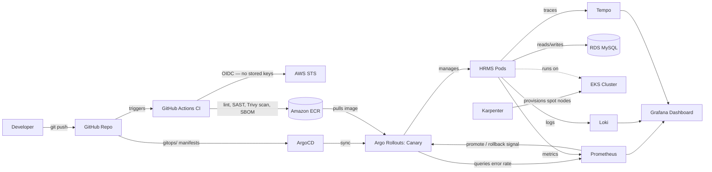

# GitOps EKS Platform — Progressive Delivery & DevSecOps Pipeline

**A personal project replicating enterprise-grade GitOps delivery end to end** — built to solve the structural problems of push-based CI/CD (stored credentials, config drift, all-or-nothing releases, static capacity) using the pull-based GitOps model instead.

`Terraform` · `AWS EKS` · `GitHub Actions (OIDC)` · `ArgoCD` · `Argo Rollouts` · `Karpenter` · `Trivy` · `Prometheus` · `Grafana` · `Loki` · `Tempo`

---

## 📋 Table of Contents

1. [Overview](#-overview)
2. [Architecture](#-architecture)
3. [Repository Structure](#-repository-structure)
4. [Prerequisites](#-prerequisites)
5. [Build Guide — Phase by Phase](#-build-guide--phase-by-phase)
6. [Security Highlights](#-security-highlights)
7. [Problems We Faced — Real Incident Log](#-problems-we-faced--real-incident-log)
8. [Cost Breakdown](#-cost-breakdown)
9. [Screenshots Guide](#-screenshots-guide)
10. [Future Improvements](#-future-improvements)

---

## 🎯 Overview

Traditional push-based CI/CD (CodePipeline/CodeDeploy style) carries structural problems: deployment credentials living inside CI, cluster state silently drifting from what's in version control, all-or-nothing releases where a bad deploy hits 100% of traffic instantly, rollbacks that need a human awake at 2 a.m., and statically sized node groups that waste money at low load.

This platform replaces that model end to end with **pull-based GitOps**:

- **Git is the single source of truth.** ArgoCD continuously reconciles the live cluster to match it — drift is corrected automatically, every change is auditable through a commit.
- **CI never holds AWS credentials.** GitHub Actions authenticates via short-lived OIDC tokens.
- **Nothing reaches the registry unscanned.** Every image passes SAST, dependency, and container vulnerability scanning, with an SBOM attached, before it can be pushed.
- **Releases are canaries, not big-bangs.** Argo Rollouts shifts traffic gradually (10% → 50% → 100%) and automatically promotes or reverts based on live Prometheus metrics — a bad release affects a fraction of traffic for minutes, then rolls itself back with zero human intervention.
- **Capacity is elastic, not guessed.** Karpenter provisions spot instances just-in-time on top of a small on-demand floor, instead of a fixed, always-on node group.

In short: **"a human pushes and hopes" → "the system converges, verifies, and self-heals."**

### Tech Stack

| Layer | Tool |
|---|---|
| Infrastructure as Code | Terraform (modular: vpc, eks, ecr, rds, github-oidc, karpenter) |
| Container Registry | Amazon ECR (immutable tags, scan-on-push) |
| CI Pipeline | GitHub Actions — lint, SAST (Semgrep), dependency + image scan (Trivy), SBOM (Syft) |
| CI → AWS Auth | GitHub OIDC federation (zero stored credentials) |
| Kubernetes | Amazon EKS |
| GitOps Delivery | ArgoCD (app-of-apps pattern) |
| Progressive Delivery | Argo Rollouts (canary + automated analysis) |
| Autoscaling | Karpenter (spot-first, on-demand floor) |
| Metrics | Prometheus (kube-prometheus-stack) |
| Logs | Loki + Promtail |
| Traces | Tempo + OpenTelemetry Collector/Java agent |
| Dashboards | Grafana — provisioned as code via the Grafana Terraform provider |
| Database | Amazon RDS (MySQL) |
| Secrets | AWS Secrets Manager |
| Application | Spring Boot 3.5 (Java 17) HRMS system |

---

## 🏗️ Architecture



> 📸 **Screenshot #1 here** — see [Screenshots Guide](#-screenshots-guide)

---

## 📁 Repository Structure

```
Gitops-Project/
├── app/
│   └── HRMS/                          # Spring Boot 3.5 application (Java 17)
│       ├── Dockerfile                 # Multi-stage build, non-root user
│       ├── pom.xml
│       └── src/main/java/com/XAMMER/HRMS/
│           └── config/
│               ├── SecurityConfig.java
│               ├── ManagementSecurityConfig.java  # permits actuator endpoints (internal port only)
│               └── ChaosFilter.java               # feature-flagged fault injection for rollback demo
│
├── .github/workflows/
│   └── ci.yml                         # lint -> SAST -> Trivy dep scan -> build -> SBOM -> Trivy image scan -> push
│
├── gitops/
│   ├── root-app.yaml                  # the ONE manifest ever applied manually - app-of-apps root
│   ├── apps/
│   │   ├── hrms-app.yaml
│   │   └── karpenter-app.yaml
│   └── manifests/
│       ├── hrms/
│       │   ├── rollout.yaml           # canary strategy, Actuator health probes
│       │   ├── service.yaml
│       │   ├── servicemonitor.yaml    # tells Prometheus to scrape the app
│       │   └── analysistemplate.yaml  # Prometheus query used for auto rollback
│       └── karpenter/
│           ├── nodeclass.yaml         # EC2NodeClass - AMI, subnets, security groups
│           └── nodepool.yaml          # NodePool - spot, instance constraints, limits
│
└── terraform/
    ├── bootstrap/                     # one-time: S3 state bucket + DynamoDB lock table
    ├── envs/prod/                     # root config - wires every module together
    └── modules/
        ├── vpc/                       # VPC, public/private subnets, NAT, routing
        ├── eks/                       # cluster, IAM roles, OIDC provider, node group
        ├── ecr/                       # container registry, lifecycle policy
        ├── rds/                       # MySQL instance, security group, Secrets Manager
        ├── github-oidc/               # CI's AWS trust - no stored keys
        ├── karpenter/                 # controller/node IAM, SQS interruption queue, discovery tags
        └── grafana-dashboard/         # dashboard-as-code via the Grafana provider
```

---

## ⚙️ Prerequisites

- AWS account with an IAM user for local Terraform runs
- AWS CLI v2, Terraform CLI, `kubectl`, `helm`, `argocd` CLI, `docker`, `jq`
- GitHub account (repos + Actions minutes)
- `kubectl-argo-rollouts` plugin (`brew install argoproj/tap/kubectl-argo-rollouts`)

---

## 🚀 Build Guide — Phase by Phase

### Phase 0 — Foundation
One-time state backend, applied locally (this is the only Terraform config allowed to use local state — it creates the remote backend everything else depends on):
```bash
cd terraform/bootstrap
terraform init && terraform plan && terraform apply
```
Creates: S3 bucket (versioned, encrypted, public access blocked) + DynamoDB lock table.

### Phase 1 — Infrastructure
```bash
cd terraform/envs/prod
terraform init && terraform plan && terraform apply
aws eks update-kubeconfig --region ap-south-1 --name prod-xrms-eks
kubectl get nodes
```
Creates: VPC (public/private subnets, NAT, IGW), EKS cluster + managed node group, ECR repository, RDS MySQL instance with credentials in Secrets Manager.

> 📸 **Screenshots #2, #3, #4 here**

### Phase 2 — CI Pipeline
GitHub Actions workflow (`.github/workflows/ci.yml`) triggered on push to `app/HRMS/**`:
1. Build & compile (Maven)
2. SAST — Semgrep, scoped exclusions documented inline with justification
3. Dependency audit — Trivy filesystem scan (chosen over OWASP Dependency-Check's live NVD sync, which is notoriously slow/rate-limited in CI)
4. Docker build → SBOM (Syft, CycloneDX format) → Trivy image scan (fails on CRITICAL) → push to ECR tagged with the git SHA

Authenticated via GitHub OIDC federation — the trust policy matches on `repository` and `ref` token claims (not the `sub` string, which GitHub changed to an immutable ID-based format for repos created after July 15, 2026).

> 📸 **Screenshots #5, #6 here**

### Phase 3 — GitOps Delivery
```bash
kubectl create namespace argocd
kubectl apply -n argocd -f https://raw.githubusercontent.com/argoproj/argo-cd/stable/manifests/install.yaml
kubectl apply -f gitops/root-app.yaml   # the only manual kubectl apply, ever
```
ArgoCD's `root-app` watches `gitops/apps/` (app-of-apps pattern) — every child Application is created automatically from Git, no further manual steps.

**Drift correction proof:**
```bash
kubectl scale deployment hrms-app -n hrms --replicas=3   # manual, out-of-band change
kubectl get pods -n hrms -w                                # watch ArgoCD revert it to match Git
```

> 📸 **Screenshots #7, #8 here**

### Phase 4 — Progressive Delivery
Converted the Deployment to a `Rollout` with canary steps and a Prometheus-backed `AnalysisTemplate` checking error rate against Micrometer's `http_server_requests_seconds_count` metric.

**Automated rollback proof** — inject a synthetic failure via the feature-flagged `ChaosFilter`:
```bash
# in gitops/manifests/hrms/rollout.yaml, add:
#   - name: CHAOS_ERROR_RATE
#     value: "0.5"
git add gitops/manifests/hrms/rollout.yaml && git commit -m "trigger chaos demo" && git push
kubectl argo rollouts get rollout hrms-app -n hrms --watch
```
Expected: canary starts at 10%, `AnalysisRun` queries Prometheus, detects >5% error rate, fails — Argo Rollouts aborts and reverts to the last stable revision automatically. Then set `CHAOS_ERROR_RATE` back to `"0"` and push.

> 📸 **Screenshots #9, #10 here**

### Phase 5 — Autoscaling & Observability

**Karpenter** (spot-first autoscaling on top of a 1-node on-demand floor):
```bash
helm upgrade --install karpenter oci://public.ecr.aws/karpenter/karpenter \
  --version 1.11.3 --namespace karpenter --create-namespace \
  --set settings.clusterName=prod-xrms-eks \
  --set settings.interruptionQueue=prod-xrms-karpenter-interruption \
  --set serviceAccount.annotations."eks\.amazonaws\.com/role-arn"=<karpenter_controller_role_arn>
```
`EC2NodeClass`/`NodePool` pushed through Git (`gitops/manifests/karpenter/`) — Karpenter auto-discovers subnets/security groups via `karpenter.sh/discovery` tags applied by Terraform.

**Observability stack:**
```bash
helm upgrade prometheus prometheus-community/kube-prometheus-stack \
  --namespace monitoring --reuse-values --set grafana.enabled=true

helm install loki grafana/loki-stack --namespace monitoring \
  --set grafana.enabled=false --set promtail.enabled=true --set loki.persistence.enabled=false
```
Grafana dashboard (request rate, error rate, pod CPU, node capacity type, HRMS logs) provisioned as code via the Grafana Terraform provider in `terraform/modules/grafana-dashboard/` — not clicked together manually.


---

## 🔐 Security Highlights

- **Zero long-lived AWS credentials in CI** — GitHub OIDC federation, scoped to this exact repo and the `main` branch
- **Least-privilege IAM throughout** — every role (CI, Karpenter controller, Karpenter nodes) scoped to only what it needs, not `AdministratorAccess`
- **Every image scanned before it can run** — SAST on source, Trivy on dependencies, Trivy on the final image, SBOM attached for supply-chain traceability
- **Non-root container** — Dockerfile creates and switches to a dedicated unprivileged user
- **Secrets never touch Git** — RDS credentials generated by Terraform, stored in AWS Secrets Manager, injected into pods as Kubernetes Secrets — never in `application.properties` or any commit
- **Network-isolated management endpoints** — Actuator health/metrics run on a separate port with no Service/Ingress exposing it outside the cluster
- **RDS is not publicly accessible** — reachable only from the EKS cluster's own security group

---

## 🧯 Problems We Faced — Real Incident Log

This project hit real, non-trivial issues :

| # | Issue | Root Cause | Fix |
|---|---|---|---|
| 1 | `terraform apply` created resources with generic names | No naming convention or tagging strategy | Introduced `local.name_prefix` pattern + `default_tags` on the provider |
| 2 | GitHub Actions failed: Trivy action version not found | Pinned to `0.24.0`, a tag Trivy retired after a supply-chain incident | Repinned to `v0.36.0` (current, immutable tag) |
| 3 | Maven test failure in CI | `HrmsApplicationTests` tried connecting to a real MySQL instance that doesn't exist in CI | Deferred: skip tests in CI for now (`-DskipTests`), documented as a known gap |
| 4 | GitHub Actions OIDC: `Not authorized to perform sts:AssumeRoleWithWebIdentity` | GitHub changed the OIDC `sub` claim format for repos created after 15 July 2026 to include immutable numeric IDs | Rewrote the trust policy to match `repository`/`ref` claims (AWS requires `sub` or `job_workflow_ref` scoped too - used a wildcard `sub` pattern for the new ID format) |
| 5 | Trivy image scan failed: CRITICAL CVEs in Tomcat/Spring Security/Thymeleaf | Spring Boot parent BOM's default managed versions were outdated | Overrode `tomcat.version`, `spring-security.version`, `thymeleaf.version` properties explicitly |
| 6 | Same CVEs reappeared after bumping Spring Boot to 3.5.12 | Assumed the newer BOM would auto-fix the CVEs - it didn't; its managed Tomcat version (`10.1.52`) was still below the fixed version (`10.1.55`) | Re-added the explicit `tomcat.version` override |
| 7 | Kubernetes health probes failing, redirected to `/login` | Spring Boot auto-secures Actuator endpoints by default whenever `spring-security` is on the classpath, even on a separate management port | Added `ManagementSecurityConfig` with `EndpointRequest.toAnyEndpoint()` permitAll, safe because the management port has no external exposure |
| 8 | Semgrep blocked the build over Actuator endpoints being enabled | Pattern-based SAST can't see network-level isolation from a properties file alone | Excluded the specific rule ID in CI with a written justification - not a blanket suppression |
| 9 | Java compilation failed: illegal `#` characters | Copy/paste corruption turned `//` comments into literal `#` characters | Recreated the file with plain code, no inline comments |
| 10 | EKS cluster billed at 6x the expected rate | Kubernetes version `1.29` had exited standard support, incurring AWS's extended-support surcharge | Bumped to `1.34`, a version in standard support |
| 11 | `EC2NodeClass` invalid: `amiSelectorTerms: Required value` | Karpenter's v1 GA API made this field mandatory; earlier examples had it optional | Added `amiSelectorTerms: [{alias: al2023@latest}]` |
| 12 | `EC2NodeClass` stuck: `SubnetsNotFound` / `SecurityGroupsNotFound` | Discovery tags were written in Terraform but never actually applied to AWS | Ran `terraform apply` for the tagging resources; also added `lifecycle { ignore_changes = [tags, tags_all] }` on the subnet resource to stop the VPC module from reverting Karpenter's tags on every apply |
| 13 | Karpenter stuck: `Failed to detect the cluster CIDR` | Controller IAM role was missing `eks:DescribeCluster` | Added the permission, restarted the controller to pick up new credentials |
| 14 | `NodePool requirements filtered out all available instance types` | `instance-category=t` + `instance-size=small` combined with an ARM64-resolved AMI left zero valid matches | Widened `instance-size` to include `medium`, keeping `amd64` explicit |
| 15 | Spot instances failed: `AuthFailure.ServiceLinkedRoleCreationNotPermitted` | AWS requires the account-level `AWSServiceRoleForEC2Spot` role to exist before anyone can launch spot capacity, and nothing had permission to create it | Added `aws_iam_service_linked_role` to Terraform - a one-time account-level fix, not a standing permission on Karpenter |
| 16 | `root-app` silently never created the `karpenter-config` Application | Two committed filenames (`karpenter-app.yaml `, `nodeclass.yaml `) had trailing spaces, so ArgoCD's directory scan mismatched them | Renamed the files, re-committed, force-refreshed |
| 17 | ArgoCD/Karpenter/everything else stuck `Pending` | A single `t3.small` floor node couldn't fit ArgoCD + Prometheus + Argo Rollouts + Karpenter + the app simultaneously | Bumped the floor to `t3.medium` |

---

## 💰 Cost Breakdown

Approximate, `ap-south-1`, assuming the full stack is left running 24/7 — the actual practice for this project was to `terraform destroy` between sessions:

| Resource | Rate | Monthly (24/7) |
|---|---|---|
| EKS control plane | $0.10/hr | ~$73 |
| NAT Gateway | ~$0.05-0.06/hr | ~$36-43 |
| 1x `t3.medium` on-demand floor node | ~$0.05/hr | ~$36 |
| Karpenter spot nodes (variable, only when needed) | ~60-70% cheaper than on-demand equivalent | usage-based |
| RDS `db.t4g.micro` | ~$0.016/hr | ~$12 |
| Elastic IP (public IPv4 charge) | $0.005/hr | ~$3.6 |
| **Total if left running all month** | | **~$160-170** |

### Opening ArgoCD
```bash
kubectl port-forward svc/argocd-server -n argocd 8080:443
kubectl get secret argocd-initial-admin-secret -n argocd -o jsonpath="{.data.password}" | base64 -d
```
Visit `https://localhost:8080` - login `admin` / the password printed above.

### Opening Grafana
```bash
kubectl port-forward svc/prometheus-grafana -n monitoring 3000:80
kubectl get secret prometheus-grafana -n monitoring -o jsonpath="{.data.admin-password}" | base64 -d
```
Visit `http://localhost:3000` - login `admin` / the password printed above. Dashboard lives under the **XRMS Platform** folder.

### Opening Prometheus
```bash
kubectl port-forward svc/prometheus-kube-prometheus-prometheus -n monitoring 9090:9090
```
Visit `http://localhost:9090/targets`.
